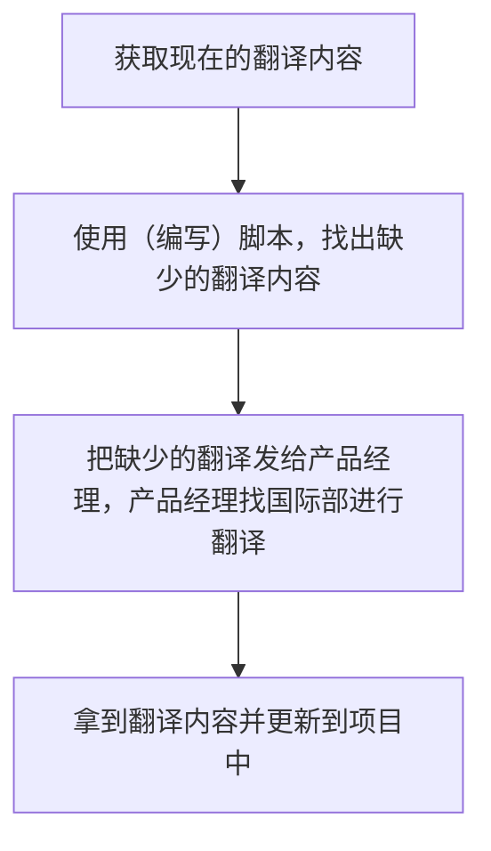
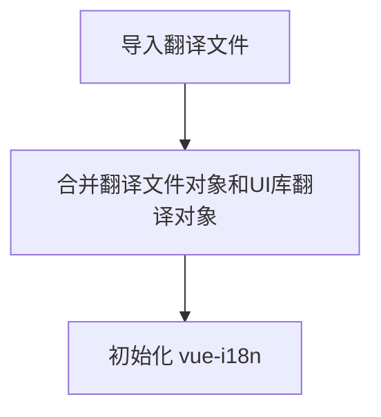

# 参考文档
[前端多语言处理--ShowDoc](http://192.168.0.161:4999/web/#/3/4392)

## 背景

由于公司的业务范围不仅仅包含大陆地区，还包括了各种和其他厂家合作的 OEM 项目，有些厂家在台湾或者国外。所以有进行多语言处理的必要，为了保证以后的开发效率，避免重复劳动，降低 Bug 数量，根据最近完成的几个多语言相关项目编写这篇总结文档。

## 原理

### 翻译获取流程

流程如下：



在完成这个流程之后，就需要在不同的项目中进行 i18n 和 l10n 的处理。

**注意：** 由于国际部并不清楚翻译的使用场景，因此有的时候翻译并不完全契合使用场景（比如用在表格头或者按钮中但没有简写），此时最好找产品经理或国际部进行翻译更新。

### 各项目处理方式

#### ngconsole

##### 关于翻译资源的文件

ngconsole 的翻译存储在和 ngconsole 目录处于同一个目录的 ngconsole_resources 的对应目录下：

- 中文版：`zh-cn\\{code,lang}.json`
- 英文版：`en\\{code,lang}.json`
- 台湾版：`zh-tw\\{code,lang}.json`

直接由前端使用的翻译存储在 **lang.json**中，后端返回错误码时也需要进行报错，对应于错误码的翻译则存储在 **code.json** 中。

**注意：** 在修改翻译文件之前，由于翻译文件行数特别多，出现冲突很容易合漏，所以最好先拉取变更再修改！

##### 在模板中使用翻译

模板中的翻译主要依靠 `localize` 等指令（js\\vdi\\i18n\\index.js）实现，比如下面的对应关系：

```html
<span
	ng-if="row.updatetype === 1 && [1, 2].includes(row.updatestatus)"
	localize="{1}下发中{2}{3}/s{4}/s"
	param1="{{ row.updatedesktopname }}"
	param2="{{ row.progress }}"
	param3="{{ row.downspeed ? (row.downspeed | voiFileSize : 'KB' : 2 : ['KB', 'MB']) : '0KB' }}"
	param4="{{ row.upspeed ? (row.upspeed | voiFileSize : 'KB' : 2 : ['KB', 'MB']) : '0KB' }}">
</span>
```

```json
{
	"{1}下发中{2}{3}/s{4}/s": "当前场景：{{1}}<br/>下发中...{{2}}%<br/>↓{{3}}/s <span style='margin-left:10px;'>↑{{4}}/s</span>"
}
```

##### 在 JavaScript 中使用翻译

只需要注入 `i18n`，然后调用`translate(text)`方法就可以获取到翻译之后的文本，下面是带参数 key 的调用方式：

```js
app.module('test').controller('Test', function($scope, i18n){
	const translated = i18n.translate("{1}下发中{2}{3}/s{4}/s", '模板', 'b', 'c', d)
})
```

默认情况下，`translate`可以获取到预期结果，但如果刚好 `lang.json` 中的 key 和`code.json`中的 key 冲突，则应该视需要手动调用`translateCode`或者`translateText`。

#### TSpace

TSpace 主要由 Vue2 编写，具有比较现代化的 i18n 框架：[开始 | Vue I18n (kazupon.github.io)](https://kazupon.github.io/vue-i18n/zh/started.html#javascript)，可以和各种库进行集成。

##### 翻译文件位置和引入

和 ngconsole 中不同，Vue 用 js 对象存储翻译内容，大概格式如下：

```json5
module.exports = {
  ticket_create_at: 'The Time of Creating the Application Form',
  // ...
  ErrorCodes: {
    101: 'Resource pool not found'
    // ...
  },
  TemplateStatus: {
    alive: 'Normal',
    // ...
  }
}

```

由于 Tspace 使用了一些组件库，所以如果引入组件库则需要考虑和 vue-i18n 集成的问题，下面同时引入了 iView 和 Element UI：

```js
import iView_zh_CN from 'view-design/dist/locale/zh-CN'
import iView_en from 'view-design/dist/locale/en-US'
import iView_zh_TW from 'view-design/dist/locale/zh-TW'
import zh_CN from './zh-cn'
import zh_TW from './zh-tw'
import en from './en'
import Vue from 'vue'
import ViewUI from 'view-design'
import VueI18n from 'vue-i18n'
import element_en from 'element-ui/lib/locale/lang/en'
import ElementLocale from 'element-ui/lib/locale'

Vue.use(ViewUI)
Vue.use(VueI18n)

const messages = {
  'zh-cn': Object.assign(iView_zh_CN, zh_CN),
  zh: Object.assign(iView_zh_CN, zh_CN), // 兼容部分谷歌的navigator.language==='zh'
  'zh-tw': Object.assign(iView_zh_TW, zh_CN, zh_TW),
  en: Object.assign(iView_en, en, element_en)
}

const i18n = new VueI18n({
  locale: sessionStorage.getItem('lang') || navigator.language.toLowerCase() || 'en', // 语言标识(zh-cn/zh-tw/en),根据当前浏览器的语言进行切换
  messages,
  silentTranslationWarn: true
})
ViewUI.i18n((key, value) => i18n.t(key, value))
ElementLocale.i18n((key, value) => i18n.t(key, value))

export default i18n
```

执行流程如下：



##### 调用方法

翻译 API 的调用方法在风格上比较统一。

```Vue
<template>
	<p>
		{{$t('to_translate')}}
	</p>
</template>

<script>
export default {
	methods: {
		test () {
			this.$t('to_translate')
		}
	}
}
</script>
```

#### UAA 平台

UAA 平台是基于 admin 框架 [Bootstrap Admin & Dashboard Template · CoreUI](https://coreui.io/)，从项目结构来看处理翻译和 Tspace 几乎一致。

## 问题与边界情况

### 翻译遗漏

#### ngconsole

##### 星期的翻译

> js\\vdi\\scheduler\\controllers.js

源码中对星期的翻译比较 tricky，属于动态拼接翻译的 key，翻译的时候要留意是否存在遗漏情况：

```js
$scope.dates.push({
	name: '周' + '日一二三四五六'[dayDate.getDay()]
})
```

##### 模板模块中的拼接字段

> 1. js\\vdi\\template\\controller.fuse.js
> 2. js\\vdi\\utils\\ui.js
> 3. js\\vdi\\template\\controller.teach.js
> 4. js\\vdi\\template\\controller.person.js

由于历史原因，这些拼接的字段**并没有**对其中的中文部分调用`translate`，所以可能会导致翻译遗漏：

```js
// 中文版
let label = `${tmpl.name} (${tmpl.cpu_num}核 /${tmpl.memory_mb / 1024}G /${tmpl.system_gb}G `

// 英文版
$scope.props = {
	_: function(s) {
		return i18n.translate(s)
	}
}
let label = `${tmpl.name (${tmpl.cpu_num}${$scope._('核')}/${tmpl.memory_mb / 1024}G  /${tmpl.system_gb}G `
```

##### zy-table 配置错误

可能会导致表头缺失翻译。

```js
// 错误方式
$scope.props = {
	_: function(s) {
		return s
	}
}

// 正确方式
$scope.props = {
	_: function(s) {
		return i18n.translate(s)
	}
}
```

#### TSpace

在写这篇文档时， TSpace 属于比较新的项目，因此在英文版的处理上需要留意更多的细节，很容易产生 Bug。

##### 中英文键名不匹配

可能由于和国际部沟通有疏漏或者自己在处理翻译的时候粗心大意，在我接手的时候存在一些中文版和英文版翻译键名不匹配的问题：

```json
// 中文
{
	"确定": "确定"
}

// 英文
{
	"OK": "OK"
}
```

在上面例子中，如果键名不匹配则英文版中写的仍然是 `$t('确定')`，这就导致了翻译缺失的问题，处理方式见下面的脚本部分。

##### 翻译遗漏

在开发的时候可能因为项目时间比较紧，为了赶时间直接将中文写死到代码中，导致在英文版中出现翻译缺失的情况，同样可以用脚本的方式进行处理。

##### 语法错误

由于国际部在给出翻译的时候不清楚翻译用在了界面的哪个地方，所以会出现譬如按钮的名称大小写和英文规范不符合的情况，遇到这种问题只能通过加强自测，多点点看页面哪里存在问题。

另外，分页器部分经常出现数字和英文之间没有空格的情况。

##### 第三方库配置有误

在解决 TSpace 翻译 bug 的时候，发现有两个 bug 是第三方库错误配置导致的。

第一个是 element ui 没有接入 vue-i18n，导致组件中出现中文，解决方法是添加 Element UI 的语言支持：

```js
const messages = {
  //...
  en: Object.assign(iView_en, en, element_en)
}

//...

ElementLocale.i18n((key, value) => i18n.t(key, value))
```

第二个是 TinyMCE 的按钮存在中文提示，解决办法是在初始化的时候配置成需要的语言（和 `sessionStorage` 中不一致，不能直接使用 `sessionStorage.lang`）：

> src/components/shared/Tinymce/index.vue

```js
window.tinymce.init({
	selector: `#${this.tinymceId}`,
	language: 'en',
	//...
})
```

第三个是级联日期选择框存在 l10n 问题（不符合地区习惯）：


> src/components/serveAdmin/summary/DesktopRanking.vue

```js
function setCascadeDate () {
  const startYear = 2021
  const now = getDate()
  this.selectedDate = now
  this.cascadeDate = Array(now[0] - startYear + 1)
	.fill(0)
	.map((_, index) => {
	  const year = startYear + index
	  const item = { label: year + this.$t('year'), value: year, type: 'year' }
	  item.children = getMonthOfYear(item.value, (sub) => {
		sub.type = 'month'
		sub.label = sub.value + this.$t('month')
		sub.children = getWeekOfMonth(...sub.fullValue, (subItem) => {
		  subItem.type = 'week'
		  subItem.label = subItem.value + this.$t('week')
		  // 如果本年的第一个月的第一周周数大于50，可判定为上一年的最后一周，为其加上年份进行说明
		  if (sub.value === 1 && subItem.fullValue[1] === 12 && subItem.value > 50) {
			subItem.label = subItem.fullValue[0] + this.$t('year') + subItem.label
		  }
		  return subItem
		})
		return sub
	  })
	  return item
	})
},
```

解决方案：询问产品经理，根据需求处理而不是简单的翻译。

### 布局问题

由英文产生的布局问题往往由以下几个原因导致。

##### 翻译过长

1. 国际部给出的翻译不符合使用场景，比如在该缩写的地方给出了完整的翻译，常见于表头或者按钮以及表单的 label，导致长度溢出。
2. 样式本身就没有考虑英文超出长度（或者超长字符串）的问题。

对应的可能改进的方法：

1. 在现在基于在线表格给出翻译的基础上，进一步注释翻译会用在界面的哪些地方，或者是否需要简写翻译。
2. 对于 label 空间不够的问题，和产品经理沟通优先采用上下结构表单方案。其他可能会超出长度的地方也需要通过沟通确定是截断还是修改布局。

##### 样式布局问题

这种问题往往是由于对样式的理解不正确而导致，比如：

white-space 和 text-align 配置有误：


应修改成：

```scss
.ivu-tooltip-inner-with-width {
  white-space: pre-wrap;
  text-align: left;
}
```

##### 组件库问题

**比如 UAA 平台日期选择框中的“英文星期”超出长度：**

**表头排序按钮无法对齐：**

碰到这种情况，一般只能通过调整 CSS 覆盖解决。

### TSpace 英文版处理流程

#### 1、找到缺失的 key

用下面的正则匹配翻译语句，并提取 key：

```js
/\$t\s?\(['"](.+?)['"]\)/gu
```

如果 key 不在翻译文件中（ngconsole_resource 和 TSpace 的语言文件都要判断），则输出。

#### 2、检测写死的中文

用下面的正则找出写死的中文语句，添加到输出之中：

```js
/(?<!\$t\()['"](.*?\p{Script=Han}+.*?)['"]/gu
```

解释：通过[后行负向零宽断言](https://www.runoob.com/w3cnote/reg-lookahead-lookbehind.html)，找出中文前面没有 `$t` 的语句（因为 key 有可能是中文）。

**局限性：** 无法检测写死在 template 中的中文。

#### 3、应用翻译和

根据结果把多出的 key 给国际部翻译，并应用到代码中。

### 总结

根据以上提及的几种情况，为了避免多语言问题，应该注意下面几点：

1. 不要为了省事，就直接把中文写死到代码中，要根据项目中的多语言处理流程添加翻译。
2. 编写样式的时候就考虑超长文本的问题，有可能涉及布局变动的需要和产品经理沟通。
3. 在使引入第三方库的时候也需要考虑和现有 i18n 框架的兼容性以及如何配置 i18n 和 l10n.
