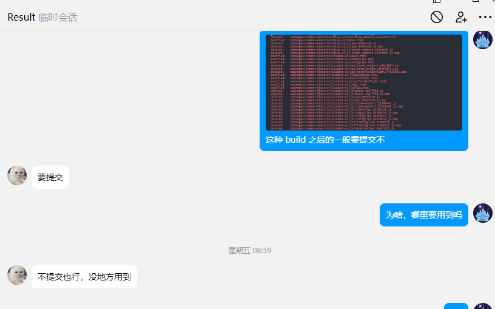
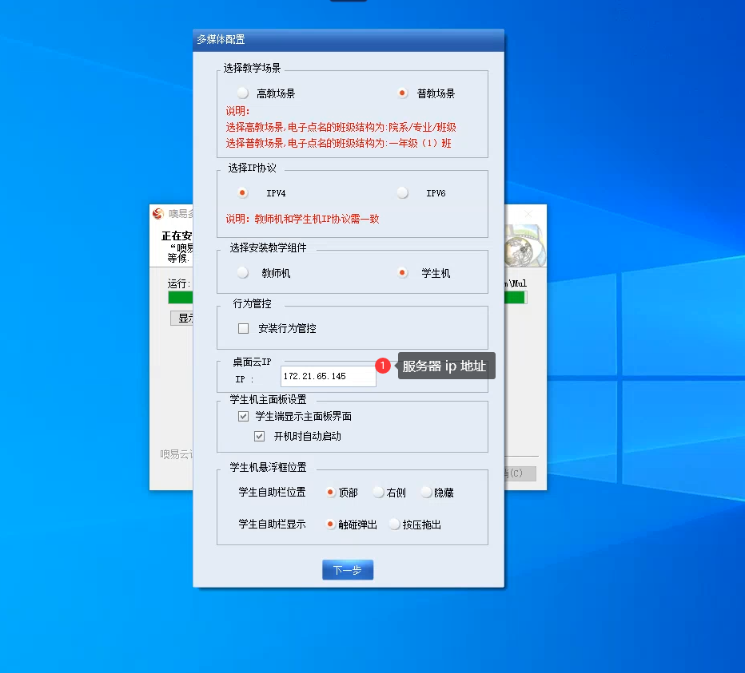
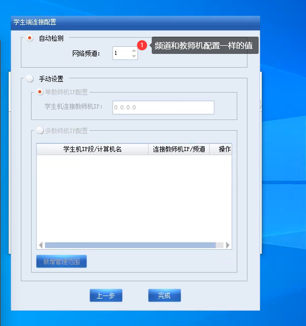

<!-- Exported from TiddlyWiki at 17:06, 28th 六月 2024 -->

# 1. 新卡片

## 1.1. 1.1

 交接-多媒体增补文档

# 2. 背景

多媒体互动教学软件是⼀套利用多媒体计算机辅助教师完成教学的软件（类似于极域教室系统）。我们称为噢易多媒体网络教室软件（信创版）（简称：信创 MMC）。现在公司已有 windows 端的多媒体，但为了可在国产芯片设备和国产操作系统上同样适配，则诞生了信创多媒体。

# 3. 业务板块


## 3.1. 框架

Electron——教师端

> Electron 是一个使用 JavaScript、HTML 和 CSS 构建桌面应用程序的框架。 嵌入 Chromium 和 Node.js 到 二进制的 Electron 允许您保持一个 JavaScript 代码代码库并创建 在 Windows 上运行的跨平台应用 macOS 和 Linux——不需要本地开发 经验。

经典项目：vscode，windows for clash

QT——学生端（在 2.1.0 版本后才改为 QT 实现，在 2.0.0 版本是由前端 electron 实现）

> Qt 是一个跨平台的 C++应用程序开发框架。广泛用于开发 GUI 程序，这种情况下又被称为部件工具箱。也可用于开发非 GUI 程序，例如控制台工具和服务器。
>
>
> GUI：图形用户界面

经典项目：WPS，YY 语音，咪咕音乐

## 3.2. 通讯方式

教师端与 server 进程相互通讯，学生端与 client 进程相互通讯，server 进程与 client 进程相互通讯。

## 3.3. 前端项目组成（2.1.0）

前端项目是一个基于 Lerna 实现的 Monorepo 项目。

* teacher-ui：教师端页面

* setup-ui：初始化配置界面

* server：前端使用 nodejs 封装的服务，其中包括 ws、http、fs 等。

* common-electron：electron 窗口初始化入口


## 3.4. 教师端通讯基本流程

启动：

1. 后端调起来我们的 common-electron（运行/common-electron/main.js），对 electron 进程初始化

1. 调用 start.sh 运行 server 进程

1. 运行前端 vue 项目

## 3.5. 消息通知

在多媒体的项目中，消息基本都是单向的（除了前端读写 server.json，因为该方法是通过 nodejs 前端自己读取）

## 3.6. ui -> server（前端到后端）

### 3.6.1. 1.vue 端发送 axios 请求（post），url 格式为：/g/:type/:sub/:context?win=x（与后端接口文档匹配）

所有的页面打开时都会加上 `win=x` 查询字符串参数，`x` 表示当前浏览器窗口的 id, 是个整数。

请求时必须在 body 里面传 json:

```json
{
"to": ["ip1", "ip2", "..."],['all']
"data": {}
}
```

```json
{
  "Channel": 1,
  "ChannelArr": [
    1
  ],
  "setlocalip": "172.21.15.105",
  "layoutAll": {
    "students": [
      {
        "key": "172.16.1.10",
        "i": "172.16.1.10",
        "isBlackScreen": false,
        "status": 1,
        "submitJobs": true,
        "isHandsUp": true,
        "computerName": "hzj",
        "student": "张1",
        "studentNum": "17103020101",
        "computerStatus": true,
        "defaultName": "asas",
        "ipSort": "172.16.1.10",
        "group": "9",
        "selected": false,
        "isGroupLeader": false,
        "loginTime": "2021-11-23 10: 17: 54",
        "isVoice": false,
        "voiceActive": "",
        "rewardNum": 0,
        "isAutoVoice": true
      },
      {
        "key": "172.16.1.11",
        "i": "172.16.1.11",
        "isBlackScreen": false,
        "status": 0,
        "submitJobs": true,
        "isHandsUp": true,
        "computerName": "LZD-20210402YCB",
        "student": "张2",
        "studentNum": "17103020102",
        "computerStatus": false,
        "defaultName": "adfs",
        "ipSort": "172.16.1.11",
        "group": "9",
        "selected": false,
        "isGroupLeader": false,
        "loginTime": "2021-11-23 10: 17: 54",
        "isVoice": false,
        "voiceActive": "",
        "rewardNum": 0,
        "isAutoVoice": true
      },
      {
        "key": "172.16.1.12",
        "i": "172.16.1.12",
        "isBlackScreen": false,
        "status": 0,
        "submitJobs": true,
        "isHandsUp": true,
        "computerName": "LZD-20210402YCC",
        "student": "张3",
        "studentNum": "17103020103",
        "computerStatus": true,
        "defaultName": "rqwe",
        "ipSort": "172.16.1.12",
        "group": "9",
        "selected": false,
        "isGroupLeader": false,
        "loginTime": "2021-11-23 10: 17: 54",
        "isVoice": false,
        "voiceActive": "",
        "rewardNum": 0,
        "isAutoVoice": true
      },
      {
        "key": "172.16.1.13",
        "i": "172.16.1.13",
        "isBlackScreen": false,
        "status": 0,
        "submitJobs": true,
        "isHandsUp": true,
        "computerName": "LZD-20210402YCD",
        "student": "张4",
        "studentNum": "17103020104",
        "computerStatus": true,
        "defaultName": "afvrrsas",
        "ipSort": "172.16.1.13",
        "group": "1",
        "selected": false,
        "isGroupLeader": true,
        "loginTime": "2021-11-23 10: 17: 54",
        "isVoice": false,
        "voiceActive": "",
        "rewardNum": 0,
        "isAutoVoice": true
      },
      {
        "key": "172.16.1.14",
        "i": "172.16.1.14",
        "isBlackScreen": false,
        "status": 0,
        "submitJobs": true,
        "isHandsUp": true,
        "computerName": "LZD-20210402YCE",
        "student": "张5",
        "studentNum": "17103020105",
        "computerStatus": true,
        "defaultName": "qsd",
        "ipSort": "172.16.1.14",
        "group": "1",
        "selected": false,
        "isGroupLeader": false,
        "loginTime": "2021-11-23 10: 17: 54",
        "isVoice": false,
        "voiceActive": "",
        "rewardNum": 0,
        "isAutoVoice": true
      },
      {
        "key": "172.16.1.15",
        "i": "172.16.1.15",
        "isBlackScreen": false,
        "status": 0,
        "submitJobs": true,
        "isHandsUp": true,
        "computerName": "LZD-20210402YCF",
        "student": "张6",
        "studentNum": "17103020106",
        "computerStatus": false,
        "defaultName": "hny",
        "ipSort": "172.16.1.15",
        "group": "1",
        "selected": false,
        "isGroupLeader": false,
        "loginTime": "2021-11-23 10: 17: 54",
        "isVoice": false,
        "voiceActive": "",
        "rewardNum": 0,
        "isAutoVoice": true
      },
      {
        "key": "172.16.1.16",
        "i": "172.16.1.16",
        "isBlackScreen": false,
        "status": 0,
        "submitJobs": true,
        "isHandsUp": true,
        "computerName": "LZD-20210402YCG",
        "student": "张7",
        "studentNum": "17103020107",
        "computerStatus": true,
        "defaultName": "ccc",
        "ipSort": "172.16.1.16",
        "group": "1",
        "selected": false,
        "isGroupLeader": false,
        "loginTime": "2021-11-23 10: 17: 54",
        "isVoice": false,
        "voiceActive": "",
        "rewardNum": 0,
        "isAutoVoice": true
      },
      {
        "key": "172.16.1.17",
        "i": "172.16.1.17",
        "isBlackScreen": false,
        "status": 0,
        "submitJobs": true,
        "isHandsUp": true,
        "computerName": "LZD-20210402YCW",
        "student": "张8",
        "studentNum": "17103020108",
        "computerStatus": true,
        "defaultName": "d",
        "ipSort": "172.16.1.17",
        "group": "1",
        "selected": false,
        "isGroupLeader": false,
        "loginTime": "2021-11-23 10: 17: 54",
        "isVoice": false,
        "voiceActive": "",
        "rewardNum": 0,
        "isAutoVoice": true
      },
      {
        "key": "172.16.1.18",
        "i": "172.16.1.18",
        "isBlackScreen": false,
        "status": 0,
        "submitJobs": true,
        "isHandsUp": true,
        "computerName": "LZD-20210402YCH",
        "student": "张9",
        "studentNum": "17103020109",
        "computerStatus": true,
        "defaultName": "ee",
        "ipSort": "172.16.1.18",
        "group": "1",
        "selected": false,
        "isGroupLeader": false,
        "loginTime": "2021-11-23 10: 17: 54",
        "isVoice": false,
        "voiceActive": "",
        "rewardNum": 0,
        "isAutoVoice": true
      },
      {
        "key": "172.16.1.19",
        "i": "172.16.1.19",
        "isBlackScreen": false,
        "status": 0,
        "submitJobs": true,
        "isHandsUp": true,
        "computerName": "LZD-20210402YCM",
        "student": "张10",
        "studentNum": "171030201010",
        "computerStatus": true,
        "defaultName": "www",
        "ipSort": "172.16.1.19",
        "group": "1",
        "selected": false,
        "isGroupLeader": false,
        "loginTime": "2021-11-23 10: 17: 54",
        "isVoice": false,
        "voiceActive": "",
        "rewardNum": 0,
        "isAutoVoice": true
      }
    ],
    "views": [
      {
        "key": "0",
        "desc": 1,
        "lock": false,
        "sortActive": "",
        "sortWay": 1,
        "colNum": 6,
        "showMode": "computerId",
        "title": "全部学生",
        "showSize": "mini",
        "child": [
          {
            "key": "172.16.1.10",
            "i": "172.16.1.10",
            "isBlackScreen": false,
            "status": 1,
            "submitJobs": true,
            "isHandsUp": true,
            "computerName": "hzj",
            "student": "张1",
            "studentNum": "17103020101",
            "computerStatus": true,
            "defaultName": "asas",
            "ipSort": "172.16.1.10",
            "group": "9",
            "selected": false,
            "isGroupLeader": false,
            "loginTime": "2021-11-23 10: 17: 54",
            "isVoice": true,
            "voiceActive": "",
            "rewardNum": 0,
            "isAutoVoice": true
          },
          {
            "key": "172.16.1.11",
            "i": "172.16.1.11",
            "isBlackScreen": false,
            "status": 0,
            "submitJobs": true,
            "isHandsUp": true,
            "computerName": "LZD-20210402YCB",
            "student": "张2",
            "studentNum": "17103020102",
            "computerStatus": false,
            "defaultName": "adfs",
            "ipSort": "172.16.1.11",
            "group": "9",
            "selected": false,
            "isGroupLeader": false,
            "loginTime": "2021-11-23 10: 17: 54",
            "isVoice": false,
            "voiceActive": "",
            "rewardNum": 0,
            "isAutoVoice": true
          },
          {
            "key": "172.16.1.12",
            "i": "172.16.1.12",
            "isBlackScreen": false,
            "status": 0,
            "submitJobs": true,
            "isHandsUp": true,
            "computerName": "LZD-20210402YCC",
            "student": "张3",
            "studentNum": "17103020103",
            "computerStatus": true,
            "defaultName": "rqwe",
            "ipSort": "172.16.1.12",
            "group": "9",
            "selected": false,
            "isGroupLeader": false,
            "loginTime": "2021-11-23 10: 17: 54",
            "isVoice": false,
            "voiceActive": "",
            "rewardNum": 0,
            "isAutoVoice": true
          },
          {
            "key": "172.16.1.13",
            "i": "172.16.1.13",
            "isBlackScreen": false,
            "status": 0,
            "submitJobs": true,
            "isHandsUp": true,
            "computerName": "LZD-20210402YCD",
            "student": "张4",
            "studentNum": "17103020104",
            "computerStatus": true,
            "defaultName": "afvrrsas",
            "ipSort": "172.16.1.13",
            "group": "1",
            "selected": false,
            "isGroupLeader": true,
            "loginTime": "2021-11-23 10: 17: 54",
            "isVoice": false,
            "voiceActive": "",
            "rewardNum": 0,
            "isAutoVoice": true
          },
          {
            "key": "172.16.1.14",
            "i": "172.16.1.14",
            "isBlackScreen": false,
            "status": 0,
            "submitJobs": true,
            "isHandsUp": true,
            "computerName": "LZD-20210402YCE",
            "student": "张5",
            "studentNum": "17103020105",
            "computerStatus": true,
            "defaultName": "qsd",
            "ipSort": "172.16.1.14",
            "group": "1",
            "selected": false,
            "isGroupLeader": false,
            "loginTime": "2021-11-23 10: 17: 54",
            "isVoice": false,
            "voiceActive": "",
            "rewardNum": 0,
            "isAutoVoice": true
          },
          {
            "key": "172.16.1.15",
            "i": "172.16.1.15",
            "isBlackScreen": false,
            "status": 0,
            "submitJobs": true,
            "isHandsUp": true,
            "computerName": "LZD-20210402YCF",
            "student": "张6",
            "studentNum": "17103020106",
            "computerStatus": false,
            "defaultName": "hny",
            "ipSort": "172.16.1.15",
            "group": "1",
            "selected": false,
            "isGroupLeader": false,
            "loginTime": "2021-11-23 10: 17: 54",
            "isVoice": false,
            "voiceActive": "",
            "rewardNum": 0,
            "isAutoVoice": true
          },
          {
            "key": "172.16.1.16",
            "i": "172.16.1.16",
            "isBlackScreen": false,
            "status": 0,
            "submitJobs": true,
            "isHandsUp": true,
            "computerName": "LZD-20210402YCG",
            "student": "张7",
            "studentNum": "17103020107",
            "computerStatus": true,
            "defaultName": "ccc",
            "ipSort": "172.16.1.16",
            "group": "1",
            "selected": false,
            "isGroupLeader": false,
            "loginTime": "2021-11-23 10: 17: 54",
            "isVoice": false,
            "voiceActive": "",
            "rewardNum": 0,
            "isAutoVoice": true
          },
          {
            "key": "172.16.1.17",
            "i": "172.16.1.17",
            "isBlackScreen": false,
            "status": 0,
            "submitJobs": true,
            "isHandsUp": true,
            "computerName": "LZD-20210402YCW",
            "student": "张8",
            "studentNum": "17103020108",
            "computerStatus": true,
            "defaultName": "d",
            "ipSort": "172.16.1.17",
            "group": "1",
            "selected": false,
            "isGroupLeader": false,
            "loginTime": "2021-11-23 10: 17: 54",
            "isVoice": false,
            "voiceActive": "",
            "rewardNum": 0,
            "isAutoVoice": true
          },
          {
            "key": "172.16.1.18",
            "i": "172.16.1.18",
            "isBlackScreen": false,
            "status": 0,
            "submitJobs": true,
            "isHandsUp": true,
            "computerName": "LZD-20210402YCH",
            "student": "张9",
            "studentNum": "17103020109",
            "computerStatus": true,
            "defaultName": "ee",
            "ipSort": "172.16.1.18",
            "group": "1",
            "selected": false,
            "isGroupLeader": false,
            "loginTime": "2021-11-23 10: 17: 54",
            "isVoice": false,
            "voiceActive": "",
            "rewardNum": 0,
            "isAutoVoice": true
          },
          {
            "key": "172.16.1.19",
            "i": "172.16.1.19",
            "isBlackScreen": false,
            "status": 0,
            "submitJobs": true,
            "isHandsUp": true,
            "computerName": "LZD-20210402YCM",
            "student": "张10",
            "studentNum": "171030201010",
            "computerStatus": true,
            "defaultName": "www",
            "ipSort": "172.16.1.19",
            "group": "1",
            "selected": false,
            "isGroupLeader": false,
            "loginTime": "2021-11-23 10: 17: 54",
            "isVoice": false,
            "voiceActive": "",
            "rewardNum": 0,
            "isAutoVoice": true
          }
        ]
      }
    ]
  },
  "input": 6,
  "teacherConfig": {
    "scene": "generalEducation",
    "machine": "teacherMachine",
    "serverIP": ""
  }
}

```

参数说明

| g       | URL   |                 | 前端标识，只有给后端发的消息带有/g标识                        |
|---------|-------|-----------------|---------------------------------------------|
| type    | URL   | String          | 多媒体协议消息类型，参考多媒体文档，协议版本使用 `v` 参数             |
| sub     | URL   | String          | 多媒体协议消息子类型，如果是 null, 传 `null`               |
| context | URL   | String          | 多媒体协议消息对象名，如果是 null, 传 `null`               |
| v       | query | Number          | 多媒体协议消息版本                                   |
| to      | body  | `Array<String>` | 多媒体消息里面的 `id` 字段，即后端会要求需要将教师端的消息发给具体的哪几台学生机 |
| data    | body  | Object          | 多媒体消息对象各字段值，必须使用小驼峰命名法                      |

### 3.6.2. 2.express 处理请求：将 url，以及 post 的 body 解析成后端要的 json（context：base64 格式），并转成字符串通过 ws 发送给后端

```js
router.post('/:type/:sub/:context', wsmw, function (req, res, next) {
  const version = req.query.v || 1
  const { type, sub, context } = req.params
  const { to, data } = req.body
  const contextstr = context === 'null' ? '' : encode(context, data)
  const json = {
 'type&name': type === 'common' ? type : `${type}:${version}`,
 sub: sub === 'null' ? null : sub,
 context: contextstr,
 id: global.config.isStudent ? '127.0.0.1' : to
  }
  req.send(json)
  res.json({ code: 0 })
})
```

### 3.6.3. ui.proto文件

前端需要从后端要这个文件，前端依赖这个文件，不然传过去的context都是null，而后端要求这个有值的。

该文件会针对前端传递的数据结构进行校验，如果校验不通过，直接是空字符串

### 3.6.4. 多媒体工作流

```bash

# 教师机界面 启动
cd packages/teacher-ui
yarn serve

# electron 启动
cd packages/common-electron
yarn serve

# mmc-electron 根目录 静态目录 提供 端口 808x
http-server

# mmc-electron 根目录 直接打包
yarn build

# 教师机 上传 本地 app.asar 包 到远程的教师机上的 资源包
sudo rm -rf app.asar /opt/mmc-server/bin/electron/resources/app.asar;wget http://172.21.15.105:8082/packages/common-electron/dist/linux-unpacked/resources/app.asar;sudo cp app.asar /opt/mmc-server/bin/electron/resources/

# /opt/mmc-server/bin 直接启动 多媒体 electron 应用 前提 使用初始化的 client.json和server.json
$MMC_SERVER_BIN/electron/common-electron --no-sandbox --disable-gpu

# 登录界面 登录接口 排查发现 code 返回1 的原因 如果出现了
# 删除 /opt/mmc-server/bin/mmc.pid 
rm -f  /opt/mmc-server/bin/*.pid

# 赵佳鑫说是server.json没权限。但我给了完整权限 导致登录界面打不开主界面 报错权限错误

# ubuntu 安装deb
sudo dpkg -i /root/桌面/mmc_2.1.0.0076-f7a90bdb.deb
apt install ./mmc_xxx
dpkg -r /opt/mmc-server

# 上传文件到ftp上 curl: (30) Could not resolve host: 21 报错* Could not resolve host: 21 failed to resolve the address provided to PORT: 21 添加 -P - 参数来启用被动模式
curl -v -T ./packages/common-electron/dist/linux-unpacked/resources/app.asar -P 21 -u admin:'123qwe!@#' "ftp://172.16.227.19/CTSC%20files/产品版本/多媒体/test/" -P -

# 同时上传多个文件
curl -v -T "./packages/common-electron/dist/linux-unpacked/resources/{app.asar,version}" -P 21 -u admin:'123qwe!@#' "ftp://172.16.227.19/CTSC%20files/产品版本/多媒体/test/" -P -


# 2.1.0-HW
curl -v -T "./packages/common-electron/dist/linux-unpacked/resources/app.asar" -P 21 -u admin:'123qwe!@#' "ftp://172.16.227.19/CTSC%20files/产品版本/多媒体/test/2.1.0-HW/" -P -

# new 2.2.0
curl -v -T "./packages/common-electron/dist/linux-unpacked/resources/{app.asar,app.asar.version}" -P 21 -u admin:'123qwe!@#' "ftp://172.16.227.19/CTSC%20files/产品版本/多媒体/test/2.2.0/" -P -

# 查看远程文件列表
curl -v -P 21 -u admin:'123qwe!@#' "ftp://172.16.227.19/CTSC%20files/产品版本/多媒体/test/" -P -
curl -P 21 -u admin:'123qwe!@#' "ftp://172.16.227.19/CTSC%20files/产品版本/多媒体/test/" -P -


# 接口更新 更新 文件 electron-mmc\packages\server\protocol\ui.proto

```

### 3.6.5. web端 mmc代码逻辑

```js
# MMCTools.vue
window.oevdi.idpApp.on('mmc_message', this.dispatchMMC)

# dispatchMMC方法 apiTypes 分支

# mmc-types.js
export const apiTypes = Object.freeze({
  CONNECTED: 'TSpaceConnected',
  DISCONNECTED: 'TSpaceDisconnected',
  STUINFO: 'LocalStuInfo',
  STUINFOUPD: 'UpdateLocalStuInfo',
  ADDSTU: 'BarrageStuMember',
  TOGGLE: 'SwitchUi',
  BARRAGE: 'Barrage',
  CAPTURE: 'ScreenShot',
  VOICE: 'Voice',
  VOICEUPD: 'StuVoice',
  VOICEOPERATE: 'TeaVoiceOper',
  BARRAGENTER: 'BarrageEnter',
  CMD: {
    BARRAGE: 'Barrage',
    CAST: 'NoteShot',
    BARRAGECLOSE: 'BarrageExit',
    CASTCLOSE: 'ShotExit',
    EXIT: 'Exit',
    // deprecated
    BARRAGE_CAST: 'BarrageNote'
  }
})


```

## 3.7. server -> ui（后端到前端）

1. 后端通过 ws 发送消息到前端

1. 主进程 收到ws消息后， 通过使用 win.webContents.send API 发送一个名为‘mmc-message’的消息，然后使用在preload中使用 ipcRenderer.on API 接收。

1. 在收到‘mmc-message’的消息后，使用 dispatchEvent 通过 windows 派发自定义事件。

1. 在所需要的页面使用 windows.addEventListener 监听处理

> ipcRenderer
>
>
> 从渲染器进程到主进程的异步通信。
>
>
> ipcMain
>
>
> 从主进程到渲染进程的异步通信。

### 3.7.1. 注意

前后端消息虽然是通过 ws 进行传输，但是消息却是我们要什么再去请求什么，他不会主动向我们推送。

例如：以缩略图交互为例（需要哪几台的缩略图就发送哪几台的 ip 地址，通过前端轮训请求）

# 4. 开发环境配置

1. 从仓库将代码 clone

1. 在最外层 install

1. 进入/packages/common-electron，新建 server.json 文件，新建 env.dev 文件

env.dev

```
NODE_ENV=development // 开发环境
TYPE=teacher // 运行教师端
IP=172.16.43.8 // 本机 ip
PORT=3333 // 占用端口
SETUP=ture // 是否已经初始化，即是否运行 setup-ui
```

1. 进入到/packages/teacher-ui，yarn serve 运行教师端界面

1. 进入到/packages/common-electron，yarn serve 运行 electron 壳子

（这里可以使用 wait-on 模块来等待 teacher-ui 占用特定端口，然后再运行 common-electron 的启动命令，只用一条命令运行。但是这样会有一个问题：假如命令为 start，则运行了 yarn start 后，等到 common-electron 运行完后，该命令最后显示的只会是 common-electrorn 占用的地址，即 ctrl+c 取消运行也只会取消 common-electron，不会取消 teacher-ui 的运行，若再次运行 start，则会多次让 teacher-ui 占用多个端口）

# 5. 教师端业务

以窗体分：分为主窗体、悬浮栏、弹窗

## 5.1. 主窗体

主窗体，即登录以及一些功能按钮入口。主窗体是有两个路由，分别为/login、/home

登录页可进行操作：激活（在线，离线）

主页面可进行操作：屏幕广播、影音广播、学生演示、遥控转播、下发作业、收取作业、远程开机、远程关机、辅助教学（黑屏肃静、电子点名、电子白板、屏幕录制、远程重启、远程命令）、课堂互动（遥控监看、击鼓传花、电子抢答、语音连麦）、固定位置上机（固定位置上机、班级座位管理）、云教室上下课

## 5.2. 悬浮工具栏

悬浮工具栏，是独立于主窗体之外的另外一个窗口。只不过不是默认的页面，而是 vue 建立的多页面，使用 electron 展现出不同的窗体。即通过 new BrowserWindow 创建的指定窗口

该工具栏共有以下功能：窗口广播、区域广播、实时语音、屏幕笔、笔记截屏、单屏控制、全体控制、自动轮训、上一页、下一页、监看设置、退出、收起、固定

功能根据不同的入口展示不同的组合。

## 5.3. 弹窗

弹窗，在多媒体项目中分为两种弹窗，一种会影响到主窗体(elementui 的弹窗)，一种不会影响到（electron 的新窗体）。即一种是 element-ui 自带的，带有遮罩且在主窗体里面的 dialog；另外一种是和悬浮工具栏一样弹窗，是可以缩小到任务栏的，使用 new BrowserWindow 创建的指定窗口。

使用 new BrowserWindow 创建的指定窗口：设置、关于、监看设置、区域广播、激活、下发作业、远程命令、退出、在线客服、击鼓传花、电子抢答

教师端目录

```
├─api // 二次封装的 axios 请求
├─assets
│ ├─css // 公共 css 样式
│ └─img // 图片资源
├─components // 组件（登录头部菜单、主页面头部菜单）
├─mixins // 可拖拽弹窗头部菜单公共 mixin
├─router // 路由
├─store // vuex
├─utils // 公共方法
└─views
├─home // 主页面入口
│ Home.vue
├─login // 登录页面入口
│ Login.vue
└─viewTop // 悬浮工具栏入口
MonitorSet.vue
ViewTop.vue
```

# 6. 自测联调等相关信息

## 6.1. 联调流程

1. 环境配置

    1. 注册 UOS 模板，并基于模板新建虚拟教室。

    1. 新建 vdi 桌面。

    1. 进入桌面，安装 mmc deb 安装包，启动学生机并切换为教师机（密码：OSeasy），设置服务器 ip。

    1. 新建隐私窗口进入另外一个桌面并安装 mmc，配置频道和教师机一致。

1. 联调

    1. 在项目根目录执行 `yarn build`。

    1. 把 *packages\common-electron\dist\linux-unpacked\resources* 中的 app.asar 包替换到桌面的 */opt/mmc-server/bin/electron/resources/* 下。

    1. 重启桌面中的 mmc 应用。

## 6.2. 测试环境

* 地址：172.16.228.5

## 6.3. build 流程

> smb 账号：dmt 密码：123456

1. `yarn build` —— teacher-ui 和 common-electron。

1. `cd packages\common-electron\; robocopy.exe .\dist\linux-unpacked\resources \\172.20.4.46\06测试共享\xufan app.asar /xo` 将打包产物发布到共享 smb 服务器上。

1. 剩下的编译产物可以提交到 git，但根据罗凯说的实际上没有用处，也可以不提交。



### 6.3.1. 关于架构差异

如果只给 *app.asar* 的话，没有任何差异：

```
🪟 🕙[ 15:35:07 ] electron-mmc\packages\common-electron on  2.1.0 [✘!?⇡1] via  v16.20.0 using 🐏 72%
PS ❯ Get-FileHash .\dist\linux-unpacked\resources\app.asar

Algorithm       Hash                                                                   Path
---------       ----                                                                   ----
SHA256          51E2CEDD1067F88062D97FDF86729BCD45F6211C5D966A9CCE697E27B7102BCB       X:\working\electron-mmc\pa…

🪟 🕙[ 15:47:13 ] electron-mmc\packages\common-electron on  2.1.0 [✘!?⇡1] via  v16.20.0 using 🐏 73%
PS ❯ Get-FileHash .\dist\linux-arm64-unpacked\resources\app.asar

Algorithm       Hash                                                                   Path
---------       ----                                                                   ----
SHA256          51E2CEDD1067F88062D97FDF86729BCD45F6211C5D966A9CCE697E27B7102BCB       X:\working\electron-mmc\pa…
```

## 6.4. 多媒体安装包路径

1. ftp://user@172.16.227.19/CTSC%20files/%B2%FA%C6%B7%B0%E6%B1%BE/%B6%E0%C3%BD%CC%E5/2.1.0/
2. 

3. 模板密码：linhq
4. OSeasy 设置密码
5. windows版本 xf xf111111 172.16.62.200 hzj 1234qwer
6. 使用 asar 解压过 app之后 执行后，一致默认读取解压后文件夹的内容  一致无法替换包资源。搞了一上午。

```bash
npm install asar -g
asar extract myapp.asar myapp_extracted
```

ssh 失败问题排查

```bash
systemctl status ssh
systemctl start ssh
```

### 6.4.1. 多媒体语音连麦状态

学生名称：`stuName = item.defaultName ? item.defaultName : (item.student ? item.student : item.computerName)`


状态：

```js
// 状态
// 1. 教师机操作状态 指令状态 前端发过去的
// typedef enum 枚举定义
// {
// EM_VOICE_CMD_ALLOW_OPEN = 1,// 允许语音开麦(学生可控) 操作： 一接入 allow
// EM_VOICE_CMD_AUTO_OPEN,// 自动开麦某学生(学生可控) 操作：接入并解除静音 auto 接入并开麦
// EM_VOICE_CMD_EXIT,// 退出语音连接
// EM_VOICE_CMD_ELEC_SEL,// 学生机开启麦克风声音(电子抢答用，开麦)
// EM_VOICE_CMD_ELEC_NO_SEL,// 学生机开启接收麦克风声音(电子抢答用，不开麦)
// EM_VOICE_CMD_OPEN,//语音开麦(学生可控)
// EM_VOICE_CMD_CLOSE,//语音关麦(学生可控)
// }VOICE_CMD_TYPE;

// 2. 开启后的语音连麦状态 显示状态 windows 和linux 一致，共用一套
// status就这几种状态
// #define VOICE_STATUS_ON_TALKING 1 // 开麦说话中
// #define VOICE_STATUS_ON_NO_TALK 2 // 开麦没说话
// #define VOICE_STATUS_SLIENT     3 // 普通静音(学生可开麦) 自己关 接入 就是静音状态
// #define VOICE_STATUS_OFF        4 // 关麦 =》 断开，不能讲话，但是可以听，可以接入进来。
// #define VOICE_STATUS_FORBIT     5 // 强制静音(学生不可开麦) 老师关 被静音操作了

// 学生机 上报状态 VOICE_STATUS 学生机 上报 自身最终状态
// typedef enum 枚举定义
// {
// EM_VOICE_STATUS_OPEN = 1,// 开麦(学生可控)
// EM_VOICE_STATUS_CLOSE,// 关麦(学生可控)
// EM_VOICE_STATUS_EXIT,// 退出
// EM_VOICE_STATUS_OPEN_NO_CTRONL,// 开麦(学生不可控)
// EM_VOICE_STATUS_CLOSE_NO_CTRONL,// 关麦(学生不可控)
// }VOICE_STATUS
```

## 6.5. 6.5

 交接-管理台

## 6.6. 遗留/待优化 Bug、任务

## 6.7. 主要功能

### 6.7.1. 教室/绑定对接教室

#### 6.7.1.1. 出现条件

* `/8081/thor/init/lang` 接口返回字段中包括 `sync_school: true`
* **角色权限设置中开启了对应权限**

#### 6.7.1.2. 关键代码

`js/vdi/menus.js` 中添加路由 meta 信息：

```js
{
 key: 'Bind_Classroom',
 value: '绑定对接教室',
 is_group: false,
 belong: 'Terminal',
 url: '/terminal/class-binding',
 only_show_when_synced: true /* meta */
}
```

`js/vdi/user/common.js` 中修改 `filterMenusSrv`，原先代码没有 TSpace 才会调用 filterFn 过滤菜单，激活 TSpace 则原样返回，当前处理是新添加一个 `filterTSpaceFn`，同时兼顾了权限设置菜单中的显示隐藏控制。

```js
.factory('filterMenusSrv', function (PROD) {
    const menusCopy = angular.copy(menus)
    const filterFn = function (item) {
      if (!PROD.TSpace && item.only_show_when_tspace) return false
      if (PROD.TSpacePE && item.hide_when_tspace_pe) return false
      if (PROD.miniDeploy && item.hide_when_mini_deploy) return false
      if (PROD.vdiStandalone && item.hide_when_only_vdi) return false
      if (!PROD.syncSchool && item.only_show_when_synced) return false /**/
      if (item.sublist) item.sublist = item.sublist.filter(filterFn)
      return true
    }
    const filterTSpaceFn = item => {
      if (!PROD.syncSchool && item.only_show_when_synced) return false /**/
      if (item.sublist) item.sublist = item.sublist.filter(filterTSpaceFn)
      return true
    }
 
    if (!PROD.miniDeploy && !PROD.vdiStandalone && PROD.TSpace && !PROD.TSpacePE) {
      return menusCopy.filter(filterTSpaceFn)
    }
    return menusCopy.filter(filterFn)
  })
```

### 6.7.2. 后端分页辅助指令

## 6.8. 后续修改需要注意的

### 6.8.1. *58892* Bug

当前的解决方案是不考虑 i18n，但如果做英文版这里需要兼容。

### 6.8.2. 终端管理高度溢出

挪到子页面后页面结构发生变化，临时使用`vh`处理。

```html
<div
  class="table-responsive"
  ng-style="{ height: getSelectedRows().length > 0 ? 'calc(100% - 70px)' : 'calc(100vh - 244px)' }">
</div>
```

### 6.8.3. *58565* 终端管理页面提示显示问题

是和页面路由有关的，如果更改页面层级或路由需要注意。

更改之后需要在 *js/vdi/vdi.js* 的 `helpTip` directive 中配置：

```js
if (/^\/resource\/network\/\d+\/?$/.test(path)) {
  path = '/resource/network/:id'
} else if (/^\/desktop\/teach\/\d+\/?$/.test(path)) {
  path = '/desktop/teach/:id'
} else if (/^\/terminal\/classes\/clients\/?$/.test(path)) {
  getSceneTipKey('/terminal/classes/clients', 'voi', 'TERMINAL_TAB')
  if ($scope.PROD.vdiStandalone) {
 path = ''
 $scope.tipKey = ''
  }
} else if (/^\/desktop\/scene\/?$/.test(path)) {
  getSceneTipKey('/desktop/scene', ['idv', 'voi'], 'SCENE_TAB')
}
```

## 6.9. 6.9

 交接-TSpace

## 6.10. mmc 环境配置

> * 多媒体安装包路径："<ftp://user@172.16.227.19/CTSC%20files/%B2%FA%C6%B7%B0%E6%B1%BE/%B6%E0%C3%BD%CC%E5/10.9.1/10.9.1.5433/SetupV10.9.1.5433.exe>"
> * 学生机设置默认密码：OSeasy

1. 新建虚拟教室
    * 绑定桌面 ip
1. 新建 vdi 教学桌面
    * win10 模板
    * 不还原
    * 激活场景
1. TSpace 引入和开放创建的教室。
1. 打开两个桌面，分别安装并配置为教室机和学生机。
1. `mv '.\general.conf' $env:APPDATA\Mmc\` 激活教师机授权。

*general.conf*

```
/RegisterType/0/
```



